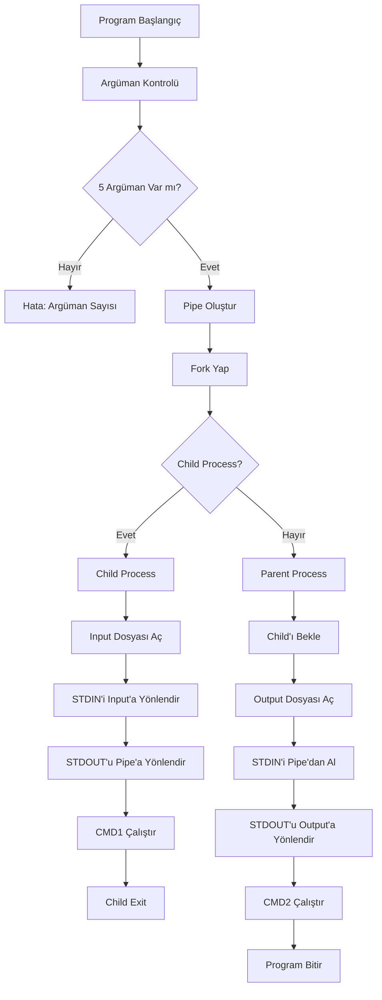

# 🔧 PIPEX - Unix Pipe Simulator

[](https://42.fr)
[](https://en.wikipedia.org/wiki/C_(programming_language))
[](https://unix.org/)

42 School projesi olan **PIPEX**, Unix pipe (|) operatörünü simüle eden bir programdır. Program, iki komut arasında pipe bağlantısı kurarak veri aktarımını sağlar ve shell'deki pipe davranışını taklit eder.

## 📋 İçindekiler

- [🔧 PIPEX - Unix Pipe Simulator](#-pipex---unix-pipe-simulator)
  - [📋 İçindekiler](#-i̇çindekiler)
  - [📁 Proje Yapısı](#-proje-yapısı)
  - [🎯 Proje Amacı](#-proje-amacı)
  - [⚙️ Temel Fonksiyonalite](#️-temel-fonksiyonalite)
  - [🎮 Kullanım](#-kullanım)
  - [🔧 Derleme](#-derleme)
  - [📊 Program Akış Diyagramı](#-program-akış-diyagramı)
  - [🏗️ Mimari Yapı](#️-mimari-yapı)
  - [🔍 Fonksiyon Detayları](#-fonksiyon-detayları)
  - [🎁 Bonus Özellikler](#-bonus-özellikler)
  - [🧪 Test Etme](#-test-etme)
  - [📚 Öğrenilen Konular](#-öğrenilen-konular)
  - [🐛 Hata Yönetimi](#-hata-yönetimi)
  - [💡 Örnek Kullanımlar](#-örnek-kullanımlar)
  - [📈 Performans](#-performans)
  - [🔒 Güvenlik](#-güvenlik)

## 📁 Proje Yapısı

```
pipe/
├── 📁 header/
│   └── pipex.h                    # Ana header dosyası
├── 📁 srcs/
│   ├── pipex.c                    # Ana program dosyası
│   ├── utils.c                    # Yardımcı fonksiyonlar
│   └── error.c                    # Hata yönetimi
├── 📁 bonus/
│   ├── pipex_bonus.h              # Bonus header
│   ├── pipex_bonus.c              # Bonus ana dosya
│   ├── pipex_bonus_lastpip.c      # Bonus pipe yönetimi
│   ├── pipex_bonus_midpip.c       # Orta pipe işlemleri
│   ├── utils_bonus.c              # Bonus yardımcı fonksiyonlar
│   └── utils2_bonus.c             # Ek bonus yardımcılar
├── 📁 lib/
│   ├── 📁 libft/                  # Libft kütüphanesi (42 standart kütüphane)
│   │   ├── *.c                    # Libft fonksiyonları
│   │   ├── libft.h                # Libft header
│   │   └── Makefile               # Libft Makefile
│   └── 📁 gnl/                    # Get Next Line kütüphanesi
│       ├── get_next_line.c        # Dosya okuma fonksiyonu
│       ├── get_next_line_bonus.c  # Bonus GNL
└── Makefile                       # Ana Makefile
```

## 🎯 Proje Amacı

PIPEX projesi, Unix sistem programlama kavramlarını öğrenmek için tasarlanmıştır:

- **Process Management**: `fork()`, `execve()`, `waitpid()` fonksiyonları
- **Inter-Process Communication**: Pipe kullanarak süreçler arası iletişim
- **File Descriptor Management**: Dosya tanımlayıcılarının yönetimi
- **Error Handling**: Sistem çağrılarında hata yönetimi
- **Memory Management**: Dinamik bellek yönetimi

## ⚙️ Temel Fonksiyonalite

Program aşağıdaki shell komutunu simüle eder:
```bash
< infile cmd1 | cmd2 > outfile
```

Bu komut şu şekilde çalışır:
1. `infile` dosyasından veri okur
2. `cmd1` komutuna stdin olarak gönderir
3. `cmd1`'in çıktısını `cmd2`'ye pipe ile aktarır
4. `cmd2`'nin çıktısını `outfile`'a yazar

## 🎮 Kullanım

### Temel Kullanım
```bash
./pipex infile "cmd1" "cmd2" outfile
```

### Örnekler
```bash
# Dosyadan cat ile okuyup grep ile filtrele
./pipex input.txt "cat" "grep hello" output.txt

# Word count example
./pipex input.txt "cat" "wc -l" output.txt

# Multiple processing
./pipex file.txt "sort" "uniq" result.txt
```

## 🔧 Derleme

### Temel Program
```bash
make                    # pipex programını derle
make clean             # Object dosyalarını temizle
make fclean            # Tüm derleme dosyalarını temizle
make re                # Temizle ve yeniden derle
```

### Bonus Program
```bash
make bonus             # pipex_bonus programını derle
make re_bonus          # Bonus'u yeniden derle
```

### Valgrind Test
```bash
make valgrind          # Memory leak testlerini çalıştır
```

## 📊 Program Akış Diyagramı



## 🏗️ Mimari Yapı

### Ana Bileşenler

1. **Pipe Management**: Process'ler arası iletişim
2. **Path Resolution**: Komut dosyalarının PATH'te bulunması
3. **File Operations**: Dosya açma/kapatma işlemleri
4. **Error Handling**: Hata durumlarının yönetimi

### Veri Akışı

```
┌─────────┐    ┌─────────┐    ┌─────────┐    ┌─────────┐    ┌─────────┐
│ infile  │───▶│  cmd1   │───▶│  pipe   │───▶│  cmd2   │───▶│ outfile │
└─────────┘    └─────────┘    └─────────┘    └─────────┘    └─────────┘
```

## 🔍 Fonksiyon Detayları

### 📄 pipex.c
- `main()`: Program giriş noktası
- `child_exec()`: Child process'te CMD1 çalıştırma
- `parent_exec()`: Parent process'te CMD2 çalıştırma
- `without_pip()`: Ana pipe işlem koordinatörü

### 🛠️ utils.c
- `pathfinder()`: PATH environment variable'da komut arama
- `execute()`: Komut çalıştırma (execve wrapper)
- `path_helper()`: PATH çözümleme yardımcısı

### ❌ error.c
- `ft_error()`: Komut bulunamadı hatası (exit 127)
- `ft_errorfd()`: Dosya bulunamadı hatası (exit 1)
- `ft_permden()`: Permission denied hatası (exit 126)
- `ft_args()`: Argüman hatası (exit 2)
- `free_array()`: Dinamik dizi temizleme

## 🎁 Bonus Özellikler

### Multiple Pipes
```bash
./pipex_bonus infile "cmd1" "cmd2" "cmd3" outfile
# Eşdeğer: < infile cmd1 | cmd2 | cmd3 > outfile
```

### Here Document
```bash
./pipex_bonus here_doc LIMITER "cmd1" "cmd2" outfile
# Eşdeğer: cmd1 << LIMITER | cmd2 >> outfile
```

### Bonus Yapısı
- **Interactive Mode**: `manipulated_pipe()` ile interaktif komut girişi
- **Multiple Commands**: Sınırsız sayıda komut zinciri
- **Heredoc Support**: Here document özelliği
- **Append Mode**: Çıktı dosyasına ekleme modu

## 🧪 Test Etme

### Temel Testler
```bash
# Normal kullanım
./pipex input.txt "cat" "grep test" output.txt

# Hata durumları
./pipex nonexistent.txt "cat" "grep test" output.txt  # Dosya yok
./pipex input.txt "invalidcmd" "grep test" output.txt # Geçersiz komut
./pipex input.txt "cat" "grep test"                   # Eksik argüman
```

### Valgrind ile Memory Leak Testi
```bash
make valgrind
# Otomatik olarak çeşitli senaryoları test eder
```

### Karşılaştırmalı Test
```bash
# Shell ile
< input.txt cat | grep test > expected.txt

# Pipex ile
./pipex input.txt "cat" "grep test" result.txt

# Karşılaştır
diff expected.txt result.txt
```

## 📚 Öğrenilen Konular

### Sistem Programlama
- Process oluşturma ve yönetimi (`fork`, `execve`, `waitpid`)
- File descriptor manipülasyonu (`dup2`)
- Pipe kullanımı (`pipe`)
- Signal handling

### C Programlama
- Memory management (malloc/free)
- String manipulation
- Error handling patterns
- Modular programming

### Unix/Linux
- PATH environment variable
- File permissions
- Standard I/O redirection
- Process communication

## 🐛 Hata Yönetimi

Program aşağıdaki hata durumlarını kontrol eder:

| Hata Tipi | Exit Code | Açıklama |
|-----------|-----------|----------|
| Argüman Hatası | 2 | Yanlış sayıda argüman |
| Dosya Hatası | 1 | Dosya bulunamadı/açılamadı |
| Permission Hatası | 126 | Dosya/komut izni yok |
| Komut Hatası | 127 | Komut bulunamadı |

### Hata Mesajları
- `"invalid number of arguments"`
- `"no such file or directory"`
- `"permission denied"`
- `"command not found"`

## 💡 Örnek Kullanımlar

### 1. Dosya İçeriği Filtreleme
```bash
./pipex data.txt "cat" "grep ERROR" errors.txt
# data.txt'den ERROR içeren satırları errors.txt'ye yaz
```

### 2. Satır Sayma
```bash
./pipex document.txt "cat" "wc -l" linecount.txt
# document.txt'deki satır sayısını linecount.txt'ye yaz
```

### 3. Sıralama ve Tekrar Eden Kayıtları Kaldırma
```bash
./pipex names.txt "sort" "uniq" unique_names.txt
# names.txt'i sırala ve tekrarları kaldır
```

### 4. Bonus - Multiple Commands
```bash
./pipex_bonus data.txt "cat" "sort" "uniq" "wc -l" result.txt
# Çoklu komut zinciri
```

### 5. Bonus - Here Document
```bash
./pipex_bonus here_doc END "cat" "grep hello" output.txt
# Here document ile interactive input
```

### 6. Bonus - Multiple Commands with Unfinished Pipe
```bash
./pipex_bonus data.txt "cat" "|"
> "grep a" outfile.txt
# Çoklu komut zinciri
```

## 📈 Performans

### Bellek Kullanımı
- Minimal bellek ayırma
- Dinamik bellek temizleme
- Memory leak koruması
- Valgrind ile doğrulanmış

### Süreç Yönetimi
- Efficient process forking
- Proper process waiting
- Resource cleanup
- Error propagation

## 🔒 Güvenlik

### Input Validation
- Argüman sayısı kontrolü
- Dosya erişim izinleri
- Komut geçerliliği
- Buffer overflow koruması

### Resource Management
- File descriptor kapatma
- Process termination
- Memory deallocation
- Error state cleanup


---

> 💡 **Not**: Bu README.md dosyası projenin kapsamlı bir dokümantasyonunu sağlar. Herhangi bir sorunuz varsa, kodları inceleyebilir veya 42 evaluation sheet'ini kontrol edebilirsiniz.
